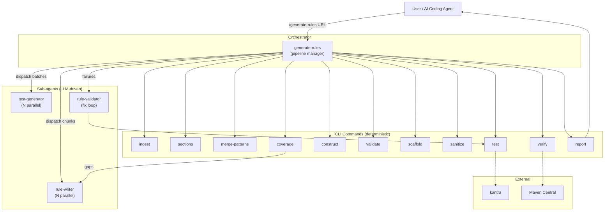
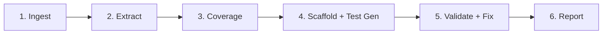
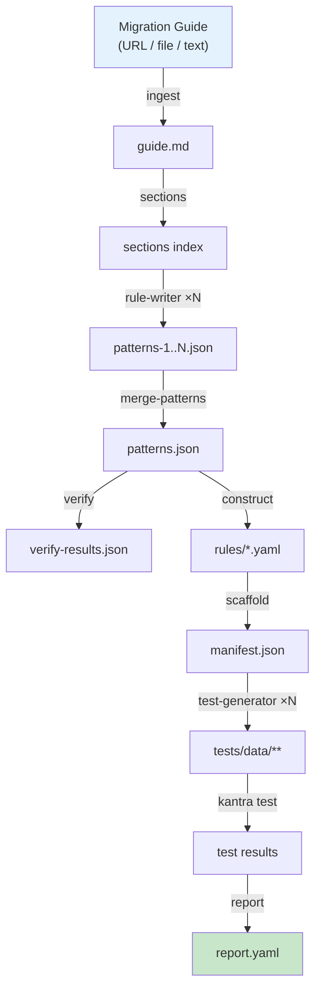

# Architecture

ai-rule-gen generates [Konveyor](https://www.konveyor.io/) analyzer migration rules from migration guides using AI agents. The system separates deterministic work (Go CLI commands) from LLM-driven work (agent skills), enabling parallel execution, resumption, and testability.

## System Overview



## Pipeline Stages



| Stage | What happens | CLI commands | Agents |
|-------|-------------|--------------|--------|
| **1. Ingest** | Fetch migration guide, follow sub-pages, produce `guide.md` | `ingest` | — |
| **2. Extract** | Index sections, extract patterns in parallel, merge, verify source FQNs, construct rule YAML | `sections`, `merge-patterns`, `verify`, `construct`, `validate` | `rule-writer` (1–5 parallel) |
| **3. Coverage** | Find guide sections with uncovered artifacts, re-extract gaps | `coverage` | `rule-writer` (1 targeted) |
| **4. Test Gen** | Scaffold test directories, generate compilable test source code | `scaffold`, `sanitize` | `test-generator` (1–5 parallel) |
| **5. Validate** | Run kantra tests, fix failing test data, iterate | `test` | `rule-validator` (up to 3 iterations) |
| **6. Report** | Collate results, generate `report.yaml` with per-rule status | `report` | — |

## Layer Separation

```
Migration Guide → Agent extracts patterns → CLI constructs rules → CLI scaffolds tests
    → Agent generates test code → kantra validates → Agent fixes failures → Tested rules
```

| Layer | What | LLM? |
|-------|------|------|
| **Agent skills** (`agents/`) | Read guides, extract patterns, generate test code, fix failures | Yes |
| **CLI commands** (`cmd/`) | Ingest, construct, validate, scaffold, sanitize, test, report | No |

The CLI never calls an LLM. It parses, transforms, validates, and invokes kantra. Agent skills handle all natural-language reasoning — reading migration guides, deciding what constitutes a pattern, writing compilable test code, and diagnosing test failures.

## Agent Skills

| Skill | Role | Parallelism |
|-------|------|-------------|
| **generate-rules** | Orchestrates the full pipeline, dispatches sub-agents | — |
| **rule-writer** | Reads guide sections, extracts migration patterns into `patterns.json` | Up to 5 parallel |
| **test-generator** | Reads manifest, generates compilable test source code | Up to 5 parallel |
| **rule-validator** | Fixes failing test data via lookup-based repair + verify loop | Sequential (up to 3 iterations) |
| **eval** | Quality scoring, app coverage, overlap detection, LLM judge | — |

Each skill has a `SKILL.md` (instructions), optional `references/` (condition types, language-specific guides), and a `contract.json` (input/output schema validated at runtime).

## CLI Commands

| Command | Purpose |
|---------|---------|
| `ingest` | Fetch URL/file, convert HTML to markdown |
| `sections` | Index guide headings, classify as content/header-only |
| `merge-patterns` | Combine partial patterns files, deduplicate |
| `verify` | Download source JARs from Maven Central, verify FQN existence |
| `construct` | Transform `patterns.json` into rule YAML files |
| `validate` | Check rule YAML structure |
| `scaffold` | Create test directories, `.test.yaml` files, `manifest.json` |
| `sanitize` | Fix malformed XML comments in test data |
| `test` | Run `kantra rules test` locally, retry timeouts |
| `coverage` | Find guide sections without extracted patterns |
| `report` | Generate `report.yaml` with per-rule test and verification status |
| `contract-validate` | Validate agent payloads against skill contracts |
| `log` | Append structured events to pipeline log |
| `eval` | Deterministic quality scoring + app coverage analysis |
| `ground-truth` | Extract API changes via japicmp or guide parsing |
| `feedback` | Aggregate pipeline run trends and failure analysis |
| `compare` | Compare rulesets side-by-side with optional app coverage |

## Data Flow



### Key Artifacts

| File | Format | Purpose |
|------|--------|---------|
| `guide.md` | Markdown | Normalized migration guide |
| `patterns.json` | JSON | Extracted migration patterns with conditions, FQNs, categories |
| `rules/*.yaml` | YAML | Konveyor analyzer rules ready for [konveyor/rulesets](https://github.com/konveyor/rulesets) |
| `tests/manifest.json` | JSON | Test metadata — groups, file list, rule assignments |
| `tests/data/` | Source code (language-dependent) | Compilable test source code triggering rule patterns |
| `report.yaml` | YAML | Per-rule test status, pass rate, timing, verification |
| `pipeline.log` | JSONL | Structured event log with agent attribution |

## Internal Packages

| Package | Responsibility |
|---------|----------------|
| `rules` | Parse, validate, serialize Konveyor rule YAML |
| `ingestion` | HTML-to-markdown conversion, URL fetching |
| `construct` | Transform patterns into rule YAML with validation |
| `scaffold` | Generate test project structure and manifests |
| `testrunner` | Execute `kantra rules test`, parse results |
| `kantraparser` | Parse kantra output, extract rule match counts |
| `verify` | Download JARs from Maven Central, verify class/method existence |
| `coverage` | Analyze guide sections, detect uncovered artifacts |
| `eval` | Quality scoring, overlap detection, app coverage via `kantra analyze` |
| `groundtruth` | japicmp-based API change extraction |
| `feedback` | Pipeline run aggregation and trend analysis |
| `contract` | Skill contract schema validation |
| `sanitize` | Fix malformed XML in test data |
| `workspace` | Report generation and timing calculations |
| `compare` | Rule-level diff, overlap detection between two rulesets |
| `integration` | Shared integration test utilities |

## Resumption

The pipeline supports resuming from any stage via `resume_from`:

| Resume point | Requires | Skips |
|-------------|----------|-------|
| `extract` | `guide.md` | Ingest |
| `coverage` | `patterns.json` | Ingest, Extract |
| `scaffold` | `rules/` | Ingest, Extract, Coverage |
| `test` | `rules/`, `manifest.json` | Everything before testing |
| `report` | Test results | Everything before report |

Missing prerequisites fail fast with a structured error.

## Logging

Every CLI command accepts `--log <path> --agent <name> --model <id>` for pipeline attribution. All entries are JSON-structured with timestamp, agent, model, stage, status, counts, elapsed, and error fields. The orchestrator logs events via `cmd/log`; sub-agents pass their own identity to CLI commands they invoke.
